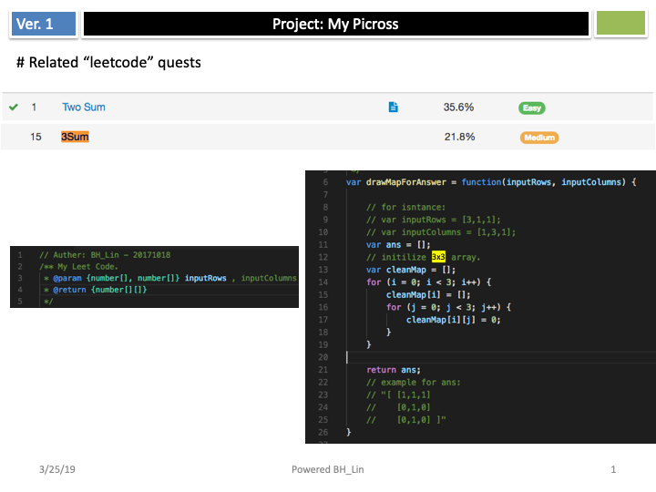
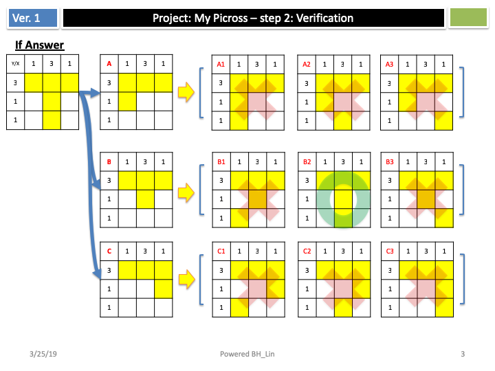

# myPicross

## Reference
[漫談 nonogram](http://kuangche.blogspot.tw/2011/08/nonogram.html)

## How to install picross on macOS by using Steam
[1]. Install Steam  

[2]. Create an account for steam  
<https://store.steampowered.com/join/>

[3]. Search “Picross Touch” and install it.  
<https://store.steampowered.com/app/476460/Picross_Touch/>
